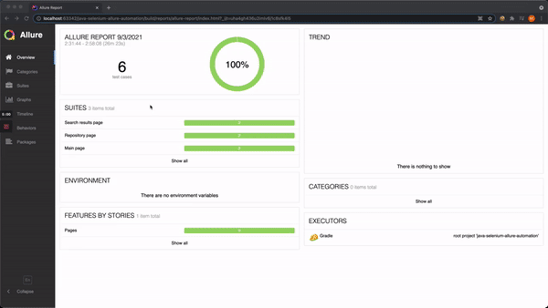

## Web Automation with Selenium for Github 

### Technology Stack

- Selenium WebDriver
- Java
- Junit5
- Allure Report
- Gradle
- Selenoid
- Browserstack

### Run tests
Copy-paste and fill configs from `resources/*.properties.example` files to `*.properties` files

Run locally: `gradlew test -Ddriver=local`

Run on selenoid: `gradlew test -Ddriver=selenoid` 

Run on browserstack: `gradlew test -Ddriver=browserstack` 

### Allure report

### Selenoid

### Browserstack

